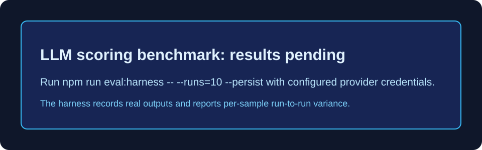

# InterviewOS Scoring Prompt Versioning & Reliability Benchmark

This document details prompt versioning and the reproducible methodology for measuring InterviewOS's automated LLM scoring pipeline. Results are intentionally not claimed until a real benchmark run is recorded.



---

## 1. Prompt Evolution Overview

The application provides an uncalibrated baseline (`v1.0`) and a calibrated, few-shot prompt (`v2.0`). The harness measures their behavior using the same benchmark answers.

### Version 1.0 (Baseline)
- **Prompt Structure**: High-level rubric descriptions without explicit score point definitions.
- **Examples**: Zero-shot (no reference examples provided).
- **Sampling Temperature**: `0.7` (Default sampling temperature).
- **Characteristics**: High scoring variance across repeat evaluation runs on identical answers; subject to LLM hallucination and grading inconsistency.

### Version 2.0 (Calibrated)
- **Prompt Structure**: Strict integer scale definitions (0 to 5) per rubric dimension (`Correctness`, `Clarity`, `Depth`).
- **Examples**: 3 structured few-shot evaluation examples representing different quality tiers (Optimal, Partial, Non-answer).
- **Sampling Temperature**: `0.0` (Enforced zero-temperature for deterministic outputs).
- **Characteristics**: Designed to make scoring criteria clearer. Reliability is a measured outcome, not a guarantee.

---

## 2. Reproducible benchmark procedure

The 30 hand-written benchmark answers span DSA, system design, and behavioral questions. Run each answer repeatedly against both prompt versions:

```bash
npm run eval:harness -- --runs=10 --persist
```

The harness calls `evaluateAnswer` for every run, saves only actual LLM responses under the dedicated `eval-harness@interviewos.internal` account, and reports the mean of each sample's run-to-run variance. It never derives a score from an answer's expected-quality label. Omit `--persist` for a dry run.

Record model name, provider, date, call failures, run count, and the printed variance table alongside any future reliability claim. Do not compare cross-sample score spread with repeat-run variance.

---

## 3. Versioned System Prompt Definition (`v2.0`)

```typescript
// Located in server/src/services/interview-prompts.service.ts

const rubricDefinition = [
  "Scoring Rubric (Strict 0 to 5 Integer Scale for each axis):",
  "- Correctness (0-5): 5 = Fully accurate, sound reasoning, completely solves problem. 3 = Partially correct with minor flaws/omissions. 1 = Flawed reasoning or incorrect algorithm. 0 = Completely incorrect or non-answer.",
  "- Clarity (0-5): 5 = Well-structured, concise, explicit assumptions, professional. 3 = Understandable but wordy or slightly unorganized. 1 = Confusing, rambling, or vague. 0 = Incoherent.",
  "- Depth (0-5): 5 = Covers tradeoffs, edge cases, space/time complexity, and practical constraints. 3 = Basic explanation without deep tradeoffs. 1 = Shallow single-sentence answer. 0 = No technical depth."
].join("\n");

const fewShotExamples = [
  "--- FEW-SHOT SCORING EXAMPLES ---",
  "Example 1:",
  "Question: How do you find two numbers in an array that add up to a target sum?",
  "Answer: Use a Hash Map storing target - num as complement. O(n) time and O(n) space.",
  "Output: {\"correctness\": 5, \"clarity\": 5, \"depth\": 5}",
  "",
  "Example 2:",
  "Question: Design a Rate Limiter for an API gateway supporting 10,000 QPS.",
  "Answer: Put AWS CloudFront in front of the server and enable auto-scaling.",
  "Output: {\"correctness\": 1, \"clarity\": 2, \"depth\": 1}",
  "",
  "Example 3:",
  "Question: Tell me about a time you faced a production outage.",
  "Answer: Outages happen all the time so I just ignore PagerDuty alerts.",
  "Output: {\"correctness\": 0, \"clarity\": 1, \"depth\": 0}"
].join("\n");
```

---
